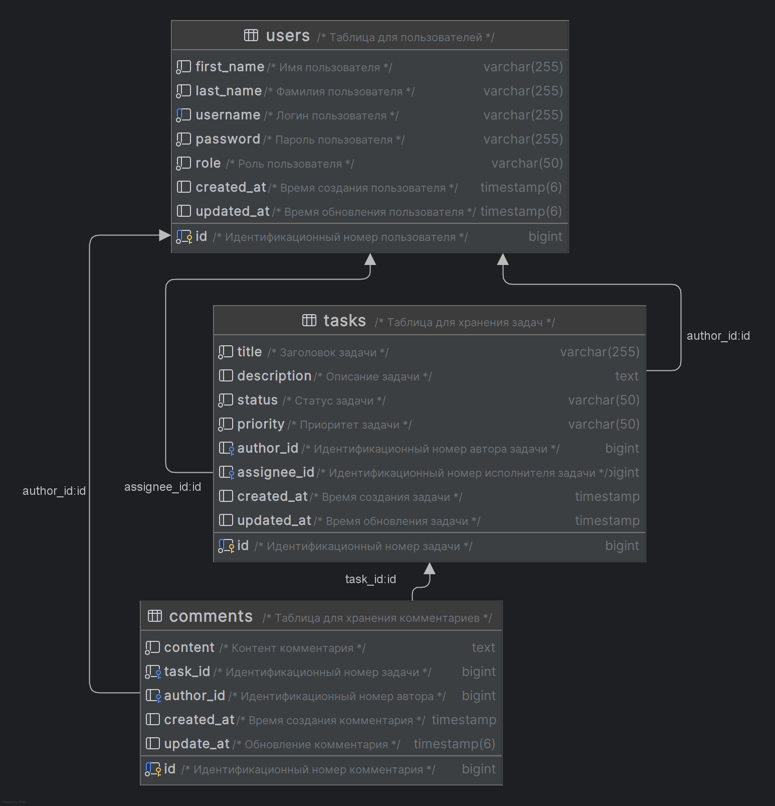

# Система управления задачами

# Полноценное веб-приложение REST написано с использованием следующих технологий:

- Maven
- Hibernate
- JPA
- PostgresSQL
- Spring Boot
- Spring security
- Docker container
- Liquibase

### Краткое описание проекта

- Автономное приложение, предоставляющее REST API

### Предварительные условия:

- Java 21
- PostgresSQL

# Запуск приложения с помощью Docker

Эта инструкция поможет вам запустить приложение в контейнере Docker.

## Предварительные требования

1. **Docker**: Убедитесь, что Docker установлен на вашем компьютере. Вы можете скачать и установить его
   с [официального сайта Docker](https://www.docker.com/get-started).

## Запуск или скачивание файла `docker-compose.yml` и `.env`

Чтобы запустить приложение с помощью docker-compose, необходимо клонировать проект к себе на компьютер, после чего
создать
в корне проекта файл `.env`, заполнить своими данными и указать с какой среды запускать `local` или `dev`:

[Генерация токена](https://openreplay.com/tools/token-generator/) : token length: `64`

```.dotenv
SPRING_PROFILES_ACTIVE="local"

JWT_SECRET_KEY="Your secret key generate token"
JWT_SECRET_KEY_LOCAL="Your secret key generate token"

POSTGRES_DB="Your database"
POSTGRES_USER="Your username"
POSTGRES_PASSWORD="Your password"

PORT="8080"
POSTGRES_DB_URL="jdbc:postgresql://db-task-management-system/${POSTGRES_DB}"
POSTGRES_DB_USERNAME="postgres"
POSTGRES_DB_PASSWORD="postgres"

PORT_LOCAL="8181"
POSTGRES_DB_URL_LOCAL="jdbc:postgresql://db-task-management-system/${POSTGRES_DB}"
POSTGRES_DB_USERNAME_LOCAL="Your username"
POSTGRES_DB_PASSWORD_LOCAL="Your password"
```

Также для удобства вы можете скачать архив с файлами `.env` и `docker-compose.yml`, который содержит необходимые
настройки для запуска приложения.

[](https://drive.google.com/drive/folders/1ztmCCncx75RUAmWTNZv3hBcFH6u-fr1M?usp=drive_link)

## Шаги для запуска приложения

### 1. Запуск приложения с помощью Docker Compose

После вышеуказанных действий прописанных в инструкции, в директории где находятся файлы прописать команду:

```bash
docker compose up
```

### После запуска приложения, можно запустить ```Swagger```

[](http://localhost:8080/swagger-ui/index.html)

### Мои запросы к приложению в Postman

[](https://documenter.getpostman.com/view/21948648/2sAYkDMLRS)

# Модель данных

## Диаграмма ER для модели данных

<a href="materials/db_diagram.png">
    
</a>

## RESTful API

**1. Описание API общих методов для аутентификации**

| METHOD | PATH          | DESCRIPTION              |
|--------|---------------|--------------------------|
| POST   | /auth/sign-up | Регистрация пользователя |
| POST   | /auth/sign-in | Авторизация пользователя |

###

**2. Описание API общих методов для управления задачами**

| METHOD | PATH                                      | DESCRIPTION                       |
|--------|-------------------------------------------|-----------------------------------|
| GET    | /api/v1/tasks                             | Получить все задачи               |
| GET    | /api/v1/tasks/{taskId}                    | Получить задачу по ее ID          |
| GET    | /api/v1/tasks/comments/by-taskId/{taskId} | Получить комментарии ее ID        |
| GET    | /api/v1/tasks/comments/author/{authorId}  | Получить комментарии по ID автора |
| GET    | /api/v1/tasks/assignee/{assigneeId}       | Получить задачи по ID исполнителя |

###

**3. Описание API общих методов для управления пользователями**

| METHOD | PATH                             | DESCRIPTION                                  |
|--------|----------------------------------|----------------------------------------------|
| POST   | /api/v1/user/comments/post       | Добавление комментарий к задаче по ID задачи |
| PATCH  | /api/v1/user/comments/update     | Обновление содержимого комментария           |
| PATCH  | /api/v1/user/tasks/update-status | Обновление задачи пользователя               |
| GET    | /api/v1/user                     | Получить список всех пользователей           |
| GET    | /api/v1/user/{userId}            | Получить информацию о пользователе по его ID |

###

**4. Описание API общих методов для управления административными функциями**

| METHOD | PATH                             | DESCRIPTION                         |
|--------|----------------------------------|-------------------------------------|
| POST   | /api/v1/admin/tasks/create-task  | Создать новую задачу                |
| POST   | /api/v1/admin/comments/post      | Добавить комментарий к задаче по ID |
| PATCH  | /api/v1/admin/comments/update    | Обновление содержимого комментария  |
| PATCH  | /api/v1/admin/tasks/update       | Обновить задачу                     |
| PATCH  | /api/v1/admin/assignee-by-taskId | Назначить исполнителя задачи по ID  |
| DELETE | /api/v1/admin/{taskId}           | Удаление задачи по ID               |